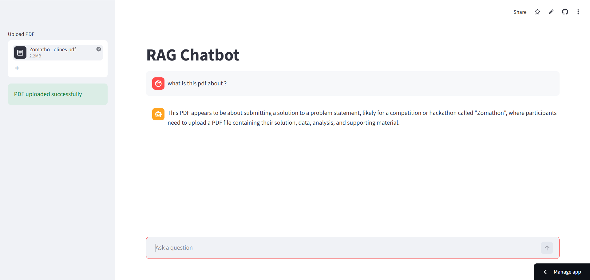

# RAG Chatbot

A lightweight Retrieval-Augmented Generation (RAG) chatbot that allows users to upload PDFs and ask questions based on document content.

## Features

- PDF upload support
- Semantic search using Pinecone
- AI responses using Groq
- FastAPI backend
- Streamlit frontend
- Dockerized setup
- Hugging Face backend deployment
- Streamlit Cloud frontend deployment

---

## Tech Stack

- FastAPI
- Streamlit
- Pinecone
- Sentence Transformers
- Groq API
- LangChain
- Docker

---

## Project Structure

```bash
.
├── app.py
├── ingest.py
├── frontend.py
├── requirements.txt
├── Dockerfile
└── README.md
```

---

## Clone Repository

```bash
git clone https://github.com/akashraj1822/RAG_Chatbot.git
cd RAG_Chatbot
```

---

## Install Dependencies

```bash
pip install -r requirements.txt
```

---

## Run Backend

```bash
uvicorn app:app --reload
```

---

## Run Frontend

```bash
streamlit run frontend.py
```

---

## Environment Variables

Create a `.env` file and add:

```env
PINECONE_API_KEY=your_key
PINECONE_INDEX_NAME=rag-chatbot
GROQ_API_KEY=your_key
```

---

## Deployment

- Backend → Hugging Face Spaces
- Frontend → Streamlit Cloud

---

## API Docs

```bash
https://your-hf-space-url/docs
```
## Demo Screenshot


